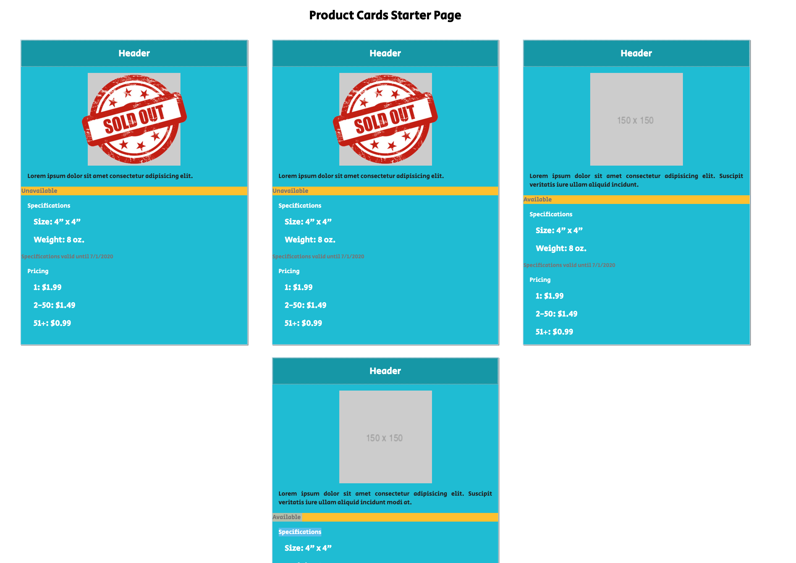

# Product Cards

## Assignment Instructions

[Instructions are here](https://github.com/nss-nightclass-projects/exercise-vault/blob/master/HTML_CSS_product_cards.md)

## Running the Code

You can use your favorite web server utility. Simply git clone the repo, then within the top-level directory, run your web server utility. Here at NSS, we've been using [http-server](https://www.npmjs.com/package/http-server).

You could also use something like Python's httpserver: `python2.7 -m SimpleHTTPServer` or `python3 -m http.server` for Python2 or Python3 versions, respectively.

## Screenshot

